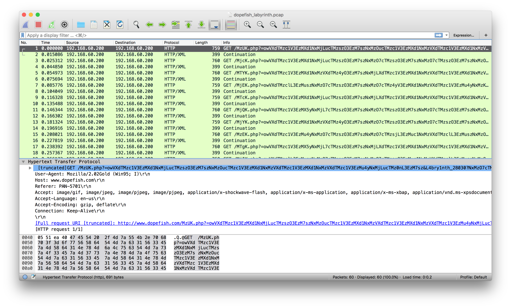
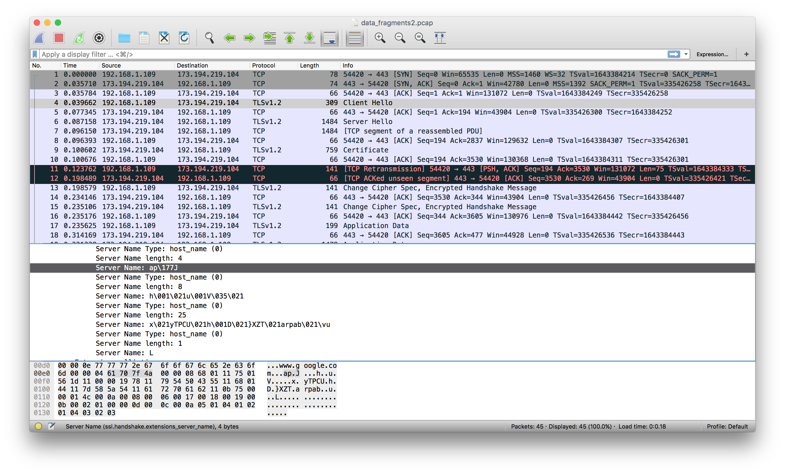
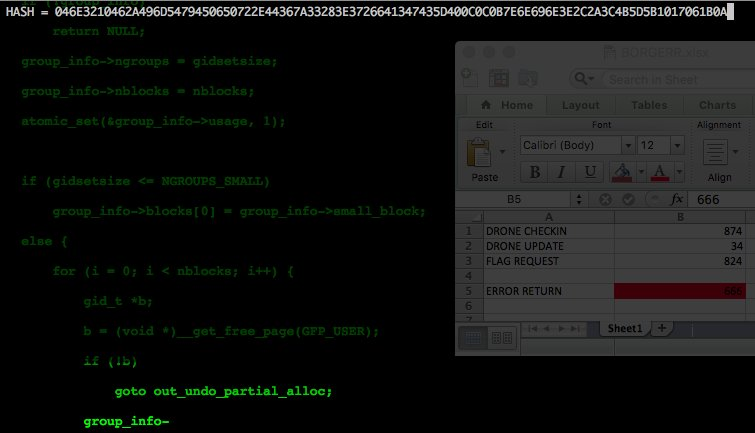
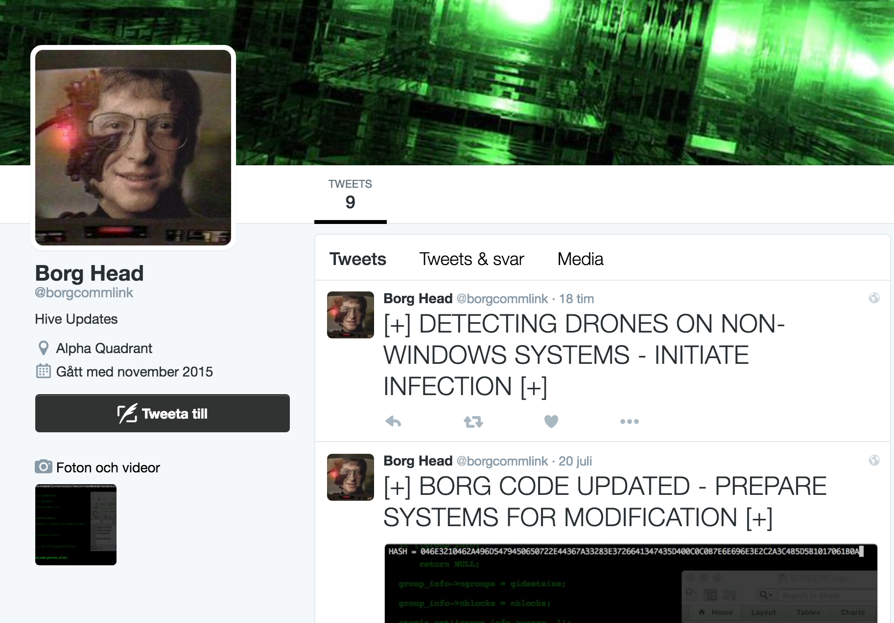

# LabyREnth write-up (Threat tier)

This is my write-up of the LabyREnth challenge, which was written during the process of solving the CTF. All of the challenges are provided as ZIP files (protected with password `infected`) in their corresponding subfolder. I have *occasionally* provided solution scripts and other data.

## 1. DopeFish

We start by unzipping the file and look at the files:

```
$ ls -la
-rw-r--r--@ 1 carl  staff  35731 22 Apr 11:13 dopefish_labyrinth.pcap
```

#### Getting the data

Getting the PCAP into Wireshark, we find a string `<!-- ohce "=4iLuMXblV2cgQXagMXYgMXagcmbphGd5JXZ2VGI09mT" -->`. It is not interesting to us, but we leave it as an exercise for the reader to decode :-).

Looking at the requests, they go to [www.dopefish.com](www.dopefish.com). This domain is owned by someone else, so the task clearly not attacking that website.



#### Analyzing the data

If we look at the length of the BASE64 encoded data, we note that doesn't decode separately. BUT -- when combined -- it adds up to length 256. Hmm... Let us decode it! We end up with a lot of repeated occurances of `317`. Let us first remove the non-relevant data(?) and look at the packets:

[decoded](threat1/decoded.png)

Do you see it? The flag? Hacking together some Python code...

```python
import re, dpkt, base64

f = open('dopefish_labyrinth.pcap' , 'rb')
pcap = dpkt.pcap.Reader(f)
list =[]

for ts, buf in pcap:

    result = re.search('GET(.*)HTTP/1.1', buf)

    if result != None:
		# just extract some relevant fields
        query = result.group(1) 
        upper = re.search('php\?(.*)&', query).group(1)
        lower = re.search('[0-9]\?(.*)-', query).group(1)
        list.append(base64.b64decode((upper+lower)[::-1]).replace('317',''))

string = ''

for x in range(len(list[0])):
    for line in list:
        if line[x] not in ['W',';','.','V','\n']: # filter out gibberish
            string += line[x]

print string
```

...and running it gives `+PAN{th3D0p3fshl1v3s}+`. Great!

## 2. yara0

The challenge archive contains two files. Let us look at them!

```
$ ls -la
-rw-r--r--@ 1 carl  staff      81 15 Jul 10:32 directions.txt
-rw-r--r--@ 1 carl  staff  364592 12 Jul 11:28 jareth1.gif

$ cat directions.txt
once you solve the challenge, submit your completed rule to 52.41.90.65 port 2600
```

Mkay... and the GIF file is:

.

Cheeky!

#### Unravelling the message

Let us take a look at the GIF. `ent jareth1.gif` shows that it is densely compressed, which would be the case with a normal GIF file. Maybe some data in the pixels? I did a *reversed* Google image search and found the original image `givinghimahand05.gif` (which is included in the `threat2` folder). Running over the frames and checking pixel, we find that the two images are identical up to pixel level. Since, the image was found on a different domain, we may conclude that no data is in the pixels.

We see however that the two images differ in size. Spider sense is tingeling! Running `binwalk -W jareth1.gif givinghimahand05.gif`, we find that they are identical up to a certain offset at which the original image ends and `jareth1.gif` continues. OK, so data has been added to the file. Doing a bit of research on GIF files, we find that `0x00 0x3B` marks end of file (or rather, `0x3B`). There is a possibility that the `jareth1.gif` image contains hidden frames, but let us first look at the hex data. There is a lot of `0xAA` at the end of the file. Could this be a XOR key? 

Incidentially, XOR-ing the differential of the two files with `0xAA` gives a 7z archive. This archive in turn contains a file named `file`, which is HTML encoded. Viewing it in a browser, we see that it displayes hex-encoded data. Unhexlifying it to binary and examining the binary representation with `xorstrings -d data`, we find that `0xAA` again is a good key. We obtain a description:

```
Write a YARA rule to find normal valid GIF files.

Write a YARA rule to detect all variations of this encoded data.
Using the template below:
1. replace each "**" pair in $header with the appropriate 6 bytes.
2. replace each "*" in $trailer with the appropriate regex.
3. replace the "*" in condition with the appropriate digit.

rule valid_gif : valid_gif
{
        strings:

			$header = { ** ** ** ** ** ** }
			$trailer = *******
				
        condition:
			$header at * and $trailer
}
```

#### Writing the rule

Now, it is just a matter of looking at the definition of GIF files. The following YARA rule does the job:

```
rule valid_gif : valid_gif
{
    strings:
        $header = {47 49 46 38 ?? 61} /*  GIF8?a */
		$trailer = /;$/

    condition:
        $header at 0 and $trailer
}
```

OK, let us try it out:

```
$ cat gif.yar | nc 52.41.90.65 2600
SUCCESS! KEY IS: PAN{848Y_wIsh3D_4w4y}
```

## 3. h0ggle.py

The next challenge is obfuscated Python code.

```
$ ls -la
-rw-r--r--@ 1 carl  staff  1071053 22 Jun 12:26 h0ggle.py
```

The obfuscation consists of repeatedly AES-encrypted and BASE64-encoded Python code contained as a string:

```
def gasfewfesafds(message, key):
        return ''.join(chr(ord(c)^ord(k)) for c,k in abtwsjxzys.izip(message, abtwsjxzys.cycle(key)))
f5fnwzeahgx7hrnl = lambda c, e, f: c.decrypt(gasfewfesafds(ufjliotyds.b64decode(e), f))
incbj7vm = tiywynstbg.new("kfdfzge3lsdwy6m9hgxdthy9htast2ht") # AES
```

Since, the very same procedure is repeated (you can verify this easily!), but with different variable and function names we can automate deobfuscation without any real effort. A simple hack brings us down to the bottom of the rabbit hole:

```python
L = qesvse.split('\n')

while True:

    s = max(L, key=len).split('=')[0]

    if len(max(L, key=len)) < 300: # some arbitrary threshold found by guessing
        print max(L, key=len)

    exec(qesvse+'\nL = '+s+'.split(\'\\n\')') # whoa, easy with the evals :-D
```

This gives `PAN{all_dir3ctionz_l3ad_n0wh3r3}`.

## 4. yara1

Again, this is a YARA challenge. We unzip and look:

```
$ ls -la
-rw-r--r--@ 1 carl  staff  29604 12 Jul 11:28 118a094d7bad21fb39401991e3336a6481fc7458d1bf26ae8e8c251f02a4ea55.doc
-rw-r--r--@ 1 carl  staff  23062 12 Jul 11:28 2bcda5291e15b759214e45c16281295a64180ca4b328b8b551381418fab92d3a.doc
-rw-r--r--@ 1 carl  staff  11211 12 Jul 11:28 6773aa2f029557eaf855fdb381b8420c53a7ad0e265a8ab9e314ad5f1c31dba6.doc
-rw-r--r--@ 1 carl  staff  11182 12 Jul 11:28 8f47a499164ce3f77d13d4e2e5f6dcf816c5ebeb44c36f6c235587b97e115de6.doc
-rw-r--r--@ 1 carl  staff  32259 12 Jul 11:28 c98ba3ce9e09197e631e6f72a5fbc6694c3d3aa279ecfa518bf734c418c1e17d.doc
-rw-r--r--@ 1 carl  staff  11197 12 Jul 11:28 cb2501420ee22affb89275ed92820f2343f0e20512f3559510bd572f60eb8d2b.doc
-rw-r--r--@ 1 carl  staff     83 15 Jul 10:36 directions.txt

$ cat directions.txt 
once you solve the challenge, submit your completed rule to 52.37.130.153 port 2600
```

Running `binwalk *.doc` we find that they are all different. But none of them is a real Word 97 document, it seems. Hmm... I created one reference document using OS X's notepad. The header of the reference file is `D0 CF 11 E0 A1 B1 1A E1` (also, according to some sources on the internet). OK, maybe we just need this for the challenge? Using our(?) newly-acquired YARA skills, we write a rule:

```
rule valid_doc : valid_doc
{
    strings:
        $header = {D0 CF 11 E0 A1 B1 1A E1}

    condition:
        $header at 0
}
```

Let us try it:

```
$ cat doc.yar | nc 52.37.130.153 2600
SUCCESS! KEY IS: PAN{7H1r7EEn-hOuR_71me_l1M17}
```

Whoa, that was almost too simple... or maybe we were just lucky? ;-)

## 5. Shrapnel / hello.pcap

In similar fashion to before, we look at our challenge data:

```
$ ls -la
-rw-r--r--@  1 carl  staff  4859341  7 Jul 09:20 hello.pcap

$ file hello.pcap 
hello.pcap: tcpdump capture file (little-endian) - version 2.4 (Ethernet, capture length 262144)
```

Nothing special here... let us move on.

#### The first PCAP

The PCAP `hello.pcap` contains a captured UDP session (Skype?) with in total 590 packets. One of these packets is a message containing the text `hello :)` and the remaining 589 ones are constant size packets. The following Python function can be used to extract the data, given a specific offset:

```python
import dpkt

def read_pcap(afile, out, offset):
	# load PCAP data
    f = open(afile , 'rb')
    g = open(out, 'wb')
	
    for ts, buf in pcap:
    	# write to buffer
	    cbuf += buf[offset:]
    
	g.write(cbuf)
```

Excluding the initial `hello :)` message, we read the data from the stream `read_pcap('hello.pcap', 'outstream', '42')`. Running `binwalk outstream`, we see that this is a bzip2 file, but it seems to be corrupt (maybe I ignored the information from Wireshark *too much*). Hmm... let us salvage the salvagable... :-)

```
$ bzcat outstream > stuff
bzcat: Compressed file ends unexpectedly;

$ file stuff
stuff: tcpdump capture file (little-endian) - version 2.4

$ mv stuff ftp-sessions.pcap
```

OK, PCAPception. Let us dig deeper!

#### The second PCAP

This PCAP contains a couple recorded FTP sessions. Using the Python code, we pick the large packets initiated with `Opening BINARY connection`. The following code interprets the FTP session and extracts a TAR file from it.

```python
import re, dpkt

bbuf = ['\x00'] * 61052 # allocate buffer

f = open('ftp-sessions.pcap' , 'rb')
pcap = dpkt.pcap.Reader(f)

position = 0
read_next = False

for ts, buf in pcap:
    
    if read_next:
        read_next = False
        bbuf[position:position+len(buf[86:])] = buf[86:]
        position = 0
        
    if 'Opening BINARY' in buf:
        read_next = True
        result = re.search('! \((.*)bytes', buf)
        ssize = int(result.group(1))
        
    if 'REST ' in buf:
        result = re.search('REST (.*)\x0d\x0a', buf)
        position = int(result.group(1))

g = open('sampled_data_from_ftp_session', 'wb')
g.write(''.join(bbuf)) # writes TAR file
```

The TAR file gives us in turn `fragments.pcap`. 

#### The third PCAP

A bit more hacking with Python extracts more data from `fragments.pcap`.

```python
import re, dpkt

data = ['\x00']*19550

count = 0
residue = ''
f = open('fragments.pcap' , 'rb')

pcap = dpkt.pcap.Reader(f)
for ts, buf in pcap:

    if len(buf) > 250 and len(buf) < 1000: # some threshold

        result = re.search('Content-Length: (.*)\r\n', buf)
        
        if result != None: 
            content_length = int(result.group(1))
            
        result = re.search('bytes (.*)-', buf)
        
        if result != None: 
            position = int(result.group(1))
            data[position:position+content_length] = buf[-content_length:]

g = open('ssl_session_to_google.pcap', 'wb')
g.write(''.join(data)) # write new PCAP
```

Looking inside `data_fragments.pcap`, we find a TLS1.2 session connecting to Google, but it is encrypted and we don't have the key. The session is using a relatively strong cipher suite (`TLS_ECDHE_RSA_WITH_AES_128_CBC_SHA`), so there is no chance brekaing it. OK, now what... Let us take a look at the pcap:



There is something strange about the names. With a little XOR magic (well, not magic really but...), we find that the key is `PAN{Y0 D0g, I Heard Y0u Like PCAPS :D}`. 

## 6. yara2

We are given a collection of files each containing a (the same) malicious code: 

```
$ ls -la
-rw-r--r--@ 1 carl  staff  12800 31 Dec  1979 0050e14f8e6bca0b2b99708f0659e38f407debec5ab7afc71de48fb104508a60
...more...

$ file 0050e14f8e6bca0b2b99708f0659e38f407debec5ab7afc71de48fb104508a60
0050e14f8e6bca0b2b99708f0659e38f407debec5ab7afc71de48fb104508a60: PE32 executable for MS Windows (GUI) Intel 80386 32-bit
```

The provided information asks us to find the longest and most efficient YARA rule. From `directions.txt`:

```
once you solve the challenge, submit your completed rule to 52.35.140.250 port 2600

Given the included archive of malware samples:

Find the longest, contiguous, most efficient rule to catch all of them.
The rule must use the hexadecimal format. 
The rule CANNOT fire on any other samples. ONLY the 48 provided.
The wildcard ("?" or "??") is allowed but not jumps "[1-6]". See http://yara.readthedocs.io/en/latest/writingrules.html#hexadecimal-strings 
The samples are included in yara_samples.7z password is "infected"
```

We *could* solve this using a modifed longest common substring algorithm (whilst keeping track of discrepancies). However, a *much* simpler way is:

1.  Manually find (or guess) a good starting point (which isn't very hard if we consider the smallest file.)
2.  Expand the rule in on or two directions, keeping track of the number of nibble (4  bit) discrepancies corresponding to the number of `?`. This number was given as a hint to be 52.
3.  Expand until the number of discrepancies has reached 52.

After a few milliseconds, it outputs

```
rule yara_challenge
{
	strings:
		$yara_challenge = {   51 53 56 8b 74 24 14 b9 03 00 00 00 8b c6 33 db 99 f7 f9 3b d3 75 04 8b c6 eb 
			16 83 fa 01 75 05 8d 46 02 eb 0c 83 fa 02 8d 46 01 74 04 8b 44 24 08 8d 0c 85 00 00 00 00 b8 56 
			55 55 55 f7 e9 8b 4c 24 1c 8b c2 c1 e8 1f 03 d0 49 3b ca 7d 06 5e 33 c0 5b 59 c3 55 8d 56 01 57 
			52 89 74 24 14 89 5c 24 28 e8 ?e ?? 00 00 8b ce 8b 74 24 1c 8b e8 8b c1 8b fd 83 c4 04 c1 e9 02 
			f3 a5 8b c8 83 e1 03 f3 a4 8b 4c 24 1c 8b 74 24 20 83 f9 03 c6 04 29 00 0f 8c 87 00 00 00 b8 ab 
			aa aa aa f7 e1 d1 ea 8d 04 52 2b c8 89 4c 24 10 8b 7c 24 24 83 c3 04 8a 0c 2f 83 c7 03 c1 f9 02 
			83 e1 3f 89 7c 24 24 8a 81 ?0 ?? ?0 ?0 88 44 1e fc 8a 4c 2f fd 8a 44 2f fe 83 e1 03 c1 f8 04 c1 
			e1 04 83 e0 0f 0b c8 8a 89 ?0 ?? ?0 ?0 88 4c 1e fd 8a 44 2f ff 8a 4c 2f fe c1 f8 06 83 e1 0f 83 
			e0 03 c1 e1 02 0b c1 8a 80 ?0 ?? ?0 ?0 88 44 1e fe 8a 4c 2f ff 83 e1 3f 4a 8a 81 ?0 ?? ?0 ?0 88 
			44 1e ff 75 8b 8b 44 24 10 83 f8 02 75 4e 8b 44 24 24 8a 0c 28 8d 7c 28 01 c1 f9 02 83 e1 3f 8a 
			91 ?0 ?? ?0 ?0 88 14 33 8a 04 28 8a 0f 83 e0 03 c1 f9 04 c1 e0 04 83 e1 0f 0b c1 8a 90 ?0 ?? ?0 
			?0 88 54 33 01 8a 07 83 e0 0f 8a 0c 85 ?0 ?? ?0 ?0 88 4c 33 02 c6 44 33 03 3d eb 38 83 f8 01 75 
			36 8b 44 24 24 8a 14 28 c1 fa 02 83 e2 3f 8a 8a ?0 ?? ?0 ?0 88 0c 33 8a 14 28 83 e2 03 c1 e2 04 
			8a 82 ?0 ?? ?0 ?0 88 44 33 01 b0 3d 88 44 33 02 88 44 33 03 83 c3 04 55 c6 04 33 00 e8 ?5 ?? 00 
			00 83 c4 04 8b c3 5f 5d 5e 5b 59 c3 90 90 90 90 90 90 90 90 90 90 53 56 8b 74 24 0c 57 8b fe 83 
			c9 ff 33 c0 f2 ae f7 d1 49 8b f9 8b c7 25 03 00 00 80 79 05 48 83 c8 fc 40 74 06 5f 5e 33 c0 5b 
			c3 68 ?4 }
	condition:
		 all of them 
}
```

The rule-derivation code can be found [here](threat6/find_rule.py). After the rule derivation, we may test it using `test.sh` making sure that all files match the rule.

```
$ cat threat6.yar | nc 52.35.140.250 2600

...
SUCCESS! KEY IS: PAN{8oogI3_WonD3rL4nd}
```

Moving on to next level... ;-)

## 7. Borgbot

This time, we are given a zipped Windows executable, a PE file named `drone.exe`:

```
$ ls -la
-rwx------@ 1 carl  staff  9647992 20 Jul 02:29 drone.exe

$ file drone.exe
drone.exe: PE32 executable for MS Windows (console) Intel 80386 32-bit
```

#### Unravelling the binary

After a little investigation, we find that it is a PyInstaller executeble (first, I thought it was a Veil-Evasion generated file, but that turned out to the false). Removing the PE header running until the first occurance of `PYZ`, we can extract it with `pyi-archive_viewer`:

```
$ pyi-archive_viewer drone.exe

 pos, length, uncompressed, iscompressed, type, name
[(0, 1873270, 1873270, 0, 'z', u'out00-PYZ.pyz'),
 (1873270, 175, 222, 1, 'm', u'pyimod00_crypto_key'),
 (1873445, 169, 234, 1, 'm', u'struct'),
 (1873614, 1139, 2690, 1, 'm', u'pyimod01_os_path'),
 (1874753, 3922, 11012, 1, 'm', u'pyimod02_archive'),
 (1878675, 5599, 17962, 1, 'm', u'pyimod03_importers'),
 (1884274, 2453, 6604, 1, 's', u'pyiboot01_bootstrap'),
 (1886727, 2101, 5794, 1, 's', u''),
```

We see a few interesting files. `pyimod00_crypto_key`, which contains the string `B0rGcUb3z4AllYez`. Not much of a hint, but may come in handy later on (or not). Also, there is a nameless file. Let us extract it! We struck the motherload! Well, sort of... The file is [here](threat7/borg.py).

Running it gives the following output (with super-pretty ASCII gfx!):

```
            ___________
           /-/_"/-/_/-/|
          /"-/-_"/-_//||
         /__________/|/|
         |"|_'='-]:+|/||
         |-+-|.|_'-"||//
         |[".[:!+-'=|//
         |='!+|-:]|-|/
          ----------

[+] BORG DRONE BOOTUP STARTING [+]
	[-] CONFIGURATION VERSION 1.0 WRITTEN

[+] FETCHING STARTUP VALUE FROM MATRIX
	[-] DATA = https://www.youtube.com/watch?v=AyenRCJ_4Ww
	[-] INITIALIZATION KEY = borgdata

[+] STARTING BORG ENCRYPTION ROUTINE [+]
	[-] RESULT = 374316062B033D0A3E6A746B46560377367A3328393720611641435A400C0C0B7E6E696E392C2C394E5B5B1717061B0A

[+] STARTING DRONE COMMUNICATION PROTOCOLS [+]
	*** ERROR RECEIVED ***
	[-] RETURNED =  HIVE|MIND|405E520E4A0E6F3401584E0A4E121E00322C24793B7E6C3304594B0E41131B032C6867207A3E2A2B484553174C0E064724696363753C372F5B40550117061B0A

[+] SHUTTING DOWN DRONE [+]
```

OK, great! So, now there is the Borg encryption. Let us break its bones and make it beg for mercy.

#### Breaking the encryption

Given the encryption algorithm `ciphertext = AABBBC(plaintext, key, AABBBF)`, we can deduce that `rev(ciphertext[i:i+8]) ⊕ ciphertext[i+8:i+16]` gives a valid plaintext block.

```python
def decrypt(X):

    for i in range(0, len(X), 2):
        y += chr(int(X[i:i+2], 16))
    
	data = ''
	
    for k in range(0,int(len(y) / 8)):
        i = 8 * k # blocks of size 8
        data += ''.join([chr(ord(i) ^ ord(j)) for i, j 
                in zip(y[i:i+8][::-1], y[i+8:i+16])])[::-1]
				
    print ''.join(data[::-1]).strip('@') # strip the padding at the end
```

Trying out `decrypt('405E520E4A0E6F3401584E0A4E121E00322C24793B7E6C3304594B0E41131B032C6867207A3E2A2B484553174C0E064724696363753C372F5B40550117061B0A')` gives us a link to a tweet: 



from the Twitter account @borgcommlink:



It contains an encrypted message; running `decrypt('046E3210462A496D5479450650722E44367A33283E3726641347435D400C0C0B7E6E696E3E2C2A3C4B5D5B1017061B0A')` gives us a Youtube [link](www.youtube.com/watch?v=rTAx8r_090o). Seemingly uninteresting. But, in the code, there is a DATA parameter which takes Youtube links. Maybe we can put a new link here? Or just send the encrypted message without messing with the key...

#### Finalizing

Trying a few modifications, we find that sending

```
AABBBB = '046E3210462A496D5479450650722E44367A33283E3726641347435D400C0C0B7E6E696E3E2C2A3C4B5D5B1017061B0A' # from tweet
scalar_array = AABBBA['scalar'][1] # window = 34
```

yields an update (which is in accordance with the tweet):

```
	[-] UPDATE SUCCESSFUL
	[-] CONFIGURATION VERSION 2.0 WRITTEN
	[-] PROCESSING COMMANDS
	[-] EXECUTING COMMAND = rm -rf /
	*** ERROR WITH COMMAND ***
	[-] NEW SERVER FUNCTION ADDED - FLAG REQUEST
	[-] FLAG REQUEST REQUIRED FOR CURRENT ENCRYPTED DATA
```

Great! This, in turn, updates `borgstruct.cfg` to

```
{
"datashat": ["submit", "the", "flag", "manually"], 
"array": [69, 80, 443, 25, 22, 2600, 666, 8443, 27500], 
"commands": ["ping", "shutdown", "nslookup", "rm"], 
"warp": ["d0rw$54p", "lss", "y.www//:sptth", "nimda//:ptf"], 
"targets": ["squirtle", "humans", "ferengi", "rick astley"], 
"scalar": [874, 34, 666], "adb": ["0xCD", "0x03", "-rf"], 
"key": ["borgcube", 2, 1, 3, 4, 5, 6, 7, 8, "startrek", "cloaking"], 
"LoadLibraryB": ["CheckRemoteDebuggerPresent", 
"UnhandledExceptionFilter", "CloseHandle", "QueryPerformanceCounter"], 
"LoadLibraryC": ["NtGetContextThread", "NtSetContextThread", "NtClose"], 
"coil": ["c.ebutu", "exe.1\\:c", "tropmmoc"],
"LoadLibraryA": ["IsDebuggerPresent", "IsDebuggerDetected", "NtQueryInformationProcess", "GetTickCount"], 
"dilithium": ["praw", "-redrocirt", "oU71v1zUo6X=v?hctaw/m"]
}
```

Hmm... the config now contains a new Youtube url. Let us try to submit it (encrypted with key `borgcube`) setting `window = 824`. The server returns (among other things):

```
...
[-] RETURNED =  PAN{m4yTh3f0rc3beWIThyOu}
...
```

Nice! That concludes the writeup of the threat tier.


## Conclusion

This was a great CTF, with a diversity in the challenges. Threat intelligence was completely new to me (I had to Google it), but I found it to be very entertaining. In hindsight, I did spend a lot of time (very much too much) on the last challenge making `scapy` work and not the acutal challenge. In the end, I had to sign up for a Amazon EC2 and complete the challenge from there (my Ramnode VPS did not work). That was a bit of pain-in-the-A. But I had a lot of fun, and that is all that matters :-) Oh, and thanks for reading. If you have any comments or questions, feel free to contact me (acpn,nmlfcjnBeockn,amo).